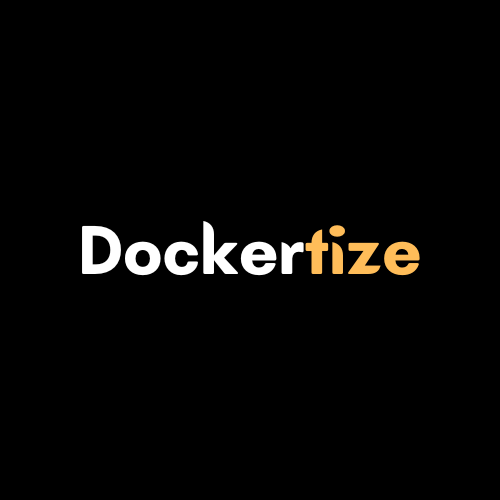

<!-- Improved compatibility of back to top link: See: https://github.com/othneildrew/Best-README-Template/pull/73 -->
<a name="readme-top"></a>
<!--
*** Thanks for checking out the Best-README-Template. If you have a suggestion
*** that would make this better, please fork the repo and create a pull request
*** or simply open an issue with the tag "enhancement".
*** Don't forget to give the project a star!
*** Thanks again! Now go create something AMAZING! :D
-->


<!-- PROJECT SHIELDS -->
<!--
*** I'm using markdown "reference style" links for readability.
*** Reference links are enclosed in brackets [ ] instead of parentheses ( ).
*** See the bottom of this document for the declaration of the reference variables
*** for contributors-url, forks-url, etc. This is an optional, concise syntax you may use.
*** https://www.markdownguide.org/basic-syntax/#reference-style-links
-->
[![Contributors][contributors-shield]][contributors-url]
[![Forks][forks-shield]][forks-url]
[![Stargazers][stars-shield]][stars-url]
[![Issues][issues-shield]][issues-url]
[![MIT License][license-shield]][license-url]
[![LinkedIn][linkedin-shield]][linkedin-url]


<!-- PROJECT LOGO -->
<br />
<div align="center">
  <a href="https://github.com/dallenpyrah/dockerit">
    
  </a>

<h3 align="center">DockerIt</h3>

  <p align="center">
    DockerIt is a Dockerfile generation tool built with Node.js and TypeScript. With DockerIt, you can easily generate a Dockerfile for your project, specifying the base image, dependencies, ports, environment variables, files to copy, and entry point. The generated Dockerfile is optimized for production use, uses a multi-stage build to minimize the final image size, and follows best practices for security and performance.
    <br />
    <a href="https://probable-degree-a99.notion.site/DockerIt-Documentation-e242a154d9f64344bf68b1b560006e3b"><strong>Explore the docs »</strong></a>
    <br />
    <br />
    <a href="https://github.com/dallenpyrah/dockerit">View Demo</a>
    ·
    <a href="https://github.com/dallenpyrah/dockerit/issues">Report Bug</a>
    ·
    <a href="https://github.com/dallenpyrah/dockerit/issues">Request Feature</a>
  </p>
</div>


<!-- TABLE OF CONTENTS -->
<details>
  <summary>Table of Contents</summary>
  <ol>
    <li>
      <a href="#about-the-project">About The Project</a>
      <ul>
        <li><a href="#built-with">Built With</a></li>
      </ul>
    </li>
    <li>
      <a href="#getting-started">Getting Started</a>
      <ul>
        <li><a href="#prerequisites">Prerequisites</a></li>
        <li><a href="#installation">Installation</a></li>
      </ul>
    </li>
    <li><a href="#usage">Usage</a></li>
    <li><a href="#roadmap">Roadmap</a></li>
    <li><a href="#contributing">Contributing</a></li>
    <li><a href="#license">License</a></li>
    <li><a href="#contact">Contact</a></li>
    <li><a href="#acknowledgments">Acknowledgments</a></li>
  </ol>
</details>


<!-- ABOUT THE PROJECT -->
## About The Project

<p align="right">(<a href="#readme-top">back to top</a>)</p>


### Built With

* [![Typescript][Typescript.ts]][Typescript-url]
* [![Prisma][Prisma.p]][Prisma-url]

<p align="right">(<a href="#readme-top">back to top</a>)</p>


<!-- GETTING STARTED -->
## Getting Started


### Installation

To use DockerIt, you will need to have Node.js installed on your machine. You can install it from the official website: Node.js.

Once you have Node.js installed, you can install DockerIt using npm:

```
npm install -g DockerIt
```

To use DockerIt, simply run the following command:

```
DockerIt generate
```

This will start the Dockerfile generation process. You will be prompted to provide information about your project, such as the base image, dependencies, ports, environment variables, files to copy, and entry point. Once you have provided all the necessary information, DockerIt will generate a Dockerfile for you.

<p align="right">(<a href="#readme-top">back to top</a>)</p>


<!-- USAGE EXAMPLES -->
## Usage

_For examples, please refer to the [Documentation](https://probable-degree-a99.notion.site/DockerIt-Documentation-e242a154d9f64344bf68b1b560006e3b)_

<p align="right">(<a href="#readme-top">back to top</a>)</p>


<!-- ROADMAP -->
## Roadmap

See the [open issues](https://github.com/github_username/repo_name/issues) for a full list of proposed features (and known issues).

<p align="right">(<a href="#readme-top">back to top</a>)</p>


<!-- CONTRIBUTING -->
## Contributing

Contributions are what make the open source community such an amazing place to learn, inspire, and create. Any contributions you make are **greatly appreciated**.

If you have a suggestion that would make this better, please fork the repo and create a pull request. You can also simply open an issue with the tag "enhancement".
Don't forget to give the project a star! Thanks again!

1. Fork the Project
2. Create your Feature Branch (`git checkout -b feature/AmazingFeature`)
3. Commit your Changes (`git commit -m 'Add some AmazingFeature'`)
4. Push to the Branch (`git push origin feature/AmazingFeature`)
5. Open a Pull Request

<p align="right">(<a href="#readme-top">back to top</a>)</p>


<!-- LICENSE -->
## License

Distributed under the MIT License. See `LICENSE.txt` for more information.

<p align="right">(<a href="#readme-top">back to top</a>)</p>


<!-- CONTACT -->
## Contact

Dallen Pyrah - [@dallenpyrah](https://twitter.com/dallenpyrah) - dallenpyrah@gmail.com

Project Link: [https://github.com/dallenpyrah/dockerit](https://github.com/dallenpyrah/dockerit)

<p align="right">(<a href="#readme-top">back to top</a>)</p>


<!-- ACKNOWLEDGMENTS -->
## Acknowledgments

* [Clack](https://github.com/natemoo-re/clack) - A big thank you to the developers of Clack for creating a powerful and user-friendly command-line interface tool that made it easy to build this project.
* [OpenAI](https://openai.com) - We would like to acknowledge OpenAI for developing cutting-edge natural language processing technology that helped power our Dockerfile generating CLI!
* [Prisma](https://github.com/prisma/prisma) - We would like to thank the developers of Prisma for creating an efficient and easy-to-use ORM tool that helped us streamline our database operations.

<p align="right">(<a href="#readme-top">back to top</a>)</p>


<!-- MARKDOWN LINKS & IMAGES -->
<!-- https://www.markdownguide.org/basic-syntax/#reference-style-links -->
[contributors-shield]: https://img.shields.io/github/contributors/dallenpyrah/dockerit.svg?style=for-the-badge
[contributors-url]: https://github.com/dallenpyrah/dockerit/graphs/contributors
[forks-shield]: https://img.shields.io/github/forks/dallenpyrah/dockerit.svg?style=for-the-badge
[forks-url]: https://github.com/dallenpyrah/dockerit/network/members
[stars-shield]: https://img.shields.io/github/stars/dallenpyrah/dockerit.svg?style=for-the-badge
[stars-url]: https://github.com/dallenpyrah/dockerit/stargazers
[issues-shield]: https://img.shields.io/github/issues/dallenpyrah/dockerit.svg?style=for-the-badge
[issues-url]: https://github.com/dallenpyrah/dockerit/issues
[license-shield]: https://img.shields.io/github/license/dallenpyrah/dockerit.svg?style=for-the-badge
[license-url]: https://github.com/dallenpyrah/dockerit/blob/master/LICENSE.txt
[linkedin-shield]: https://img.shields.io/badge/-LinkedIn-black.svg?style=for-the-badge&logo=linkedin&colorB=555
[linkedin-url]: https://linkedin.com/in/linkedin_username
[product-screenshot]: images/screenshot.png
[Typescript.ts]: https://img.shields.io/badge/Typescript-T-blue
[Typescript-url]: https://www.typescriptlang.org
[Prisma.p]: https://img.shields.io/badge/Prisma-Next--generation%20Node.js%20and%20TypeScript%20ORM-purple
[Prisma-url]: https://www.prisma.io
